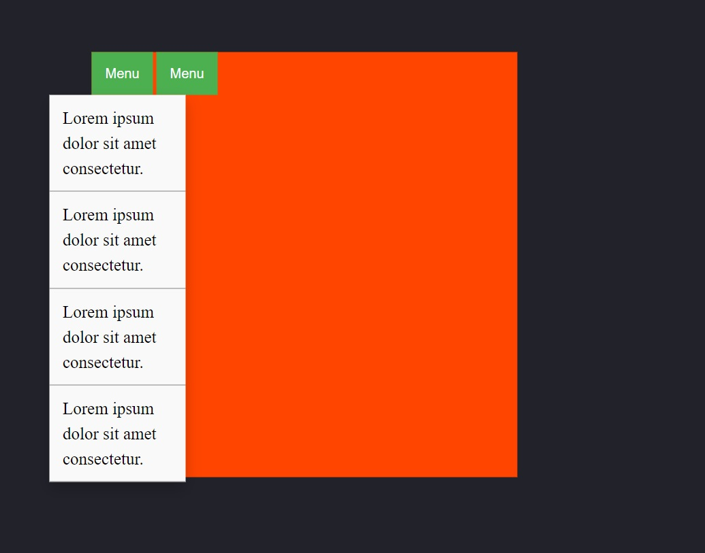

# Simple html-css templates of frequently used elements
## Examples of adaptive forms for data entry:

- Flexbox template 1
  

----

## Examples of simple responsive layouts using flexbox:

- Flexbox template 1
  

- Flexbox template 2
  

- Flexbox template 3
  

- Flexbox template 4
  

- Flexbox template 5
  

- Flexbox template 6
  

- Flexbox template 7
  

- Flexbox template 8
  

- Flexbox template 9
  

----

## Examples of simple dropdown menus

- Dropdown template 1

