# Simple html-css templates of frequently used elements
## Examples of adaptive forms for data entry:

- Form template 1
  
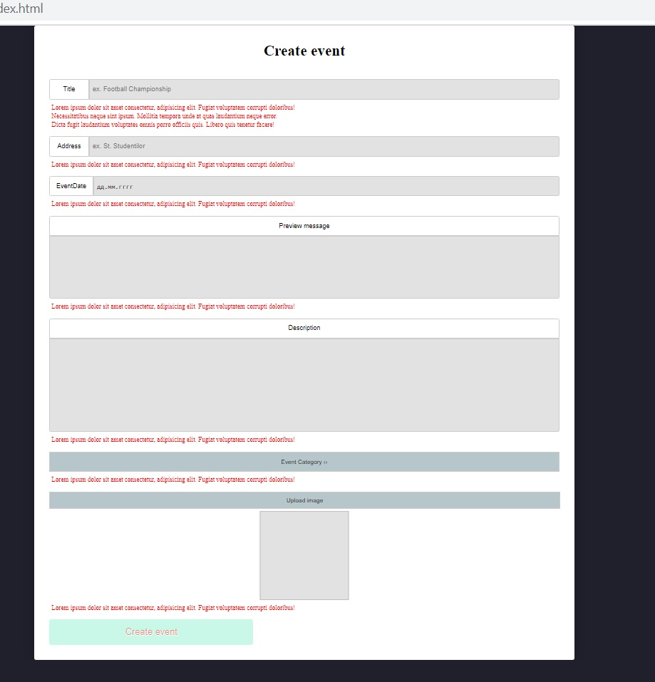

- Form template 2
  
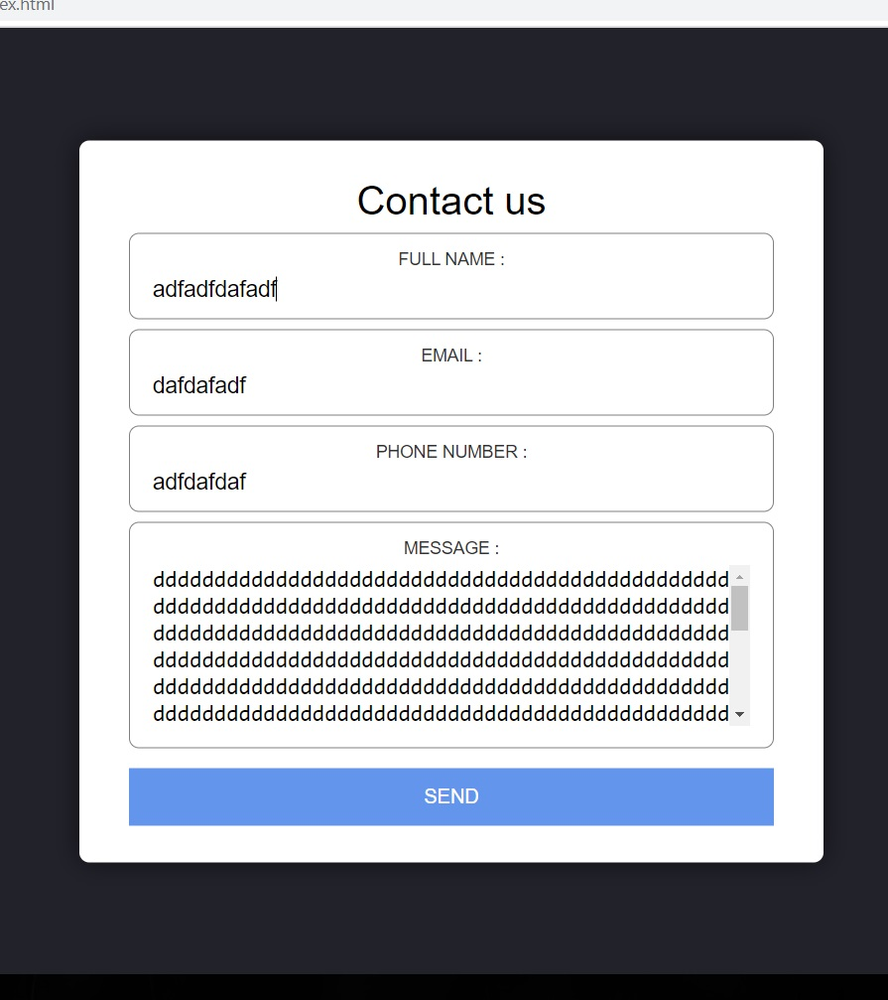

- Form template 3
  

----

## Examples of simple responsive layouts using flexbox:

- Responsive header nav menu
  
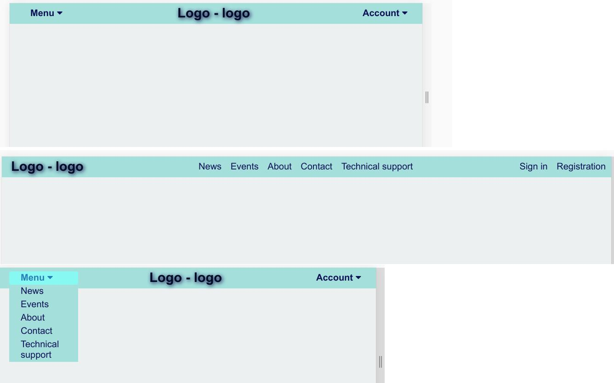

- Flexbox template 1
  
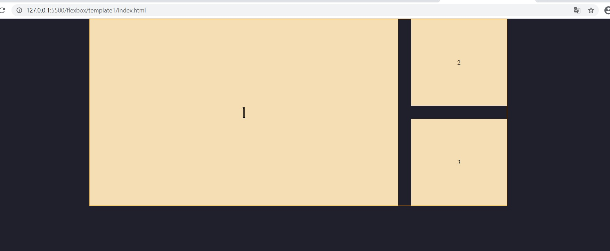

- Flexbox template 2
  
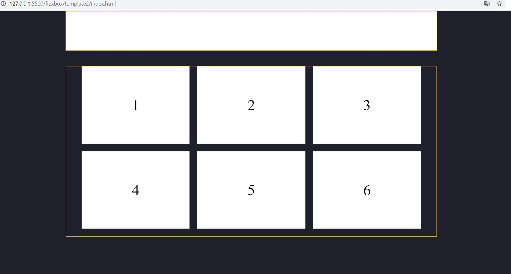

- Flexbox template 3
  
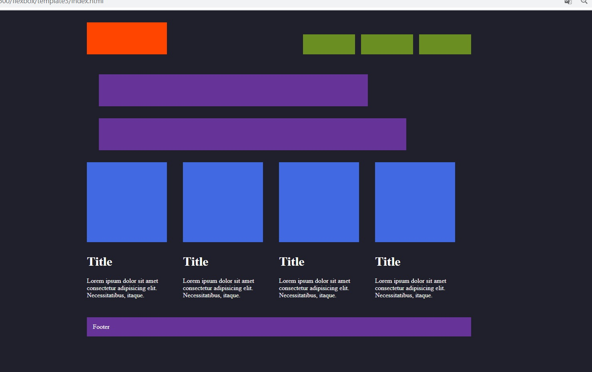

- Flexbox template 4
  
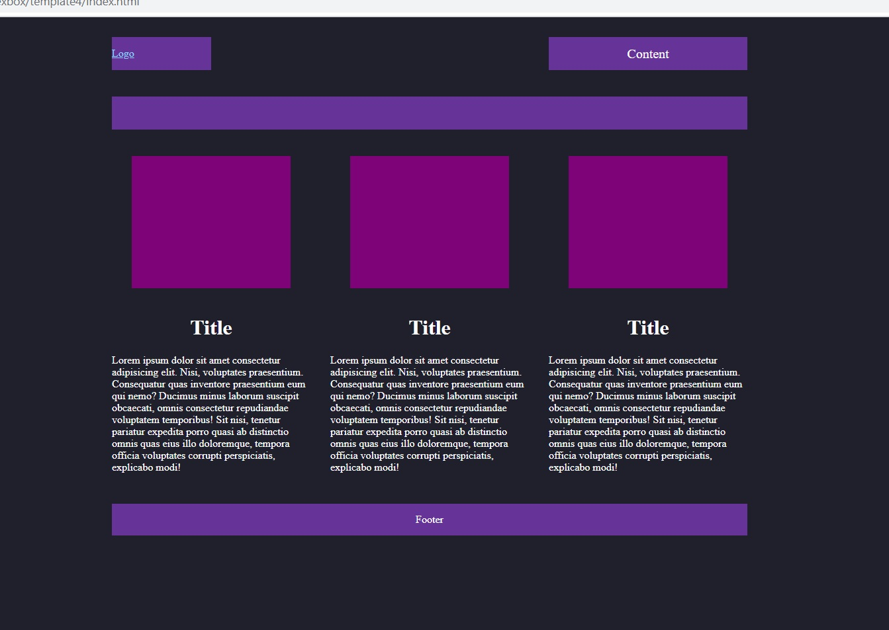

- Flexbox template 5

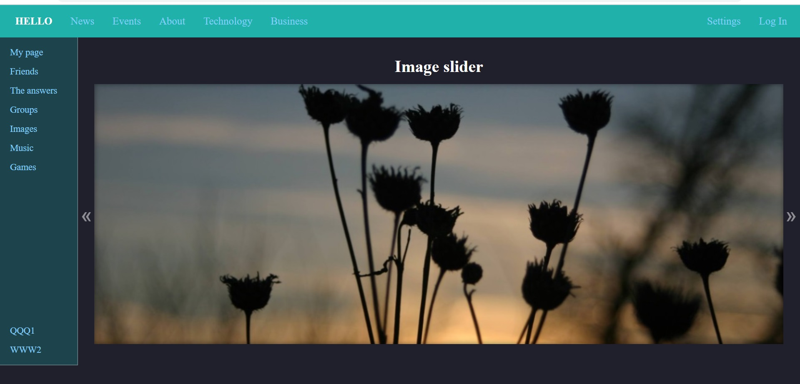

- Flexbox template 6
  

- Flexbox template 7
  
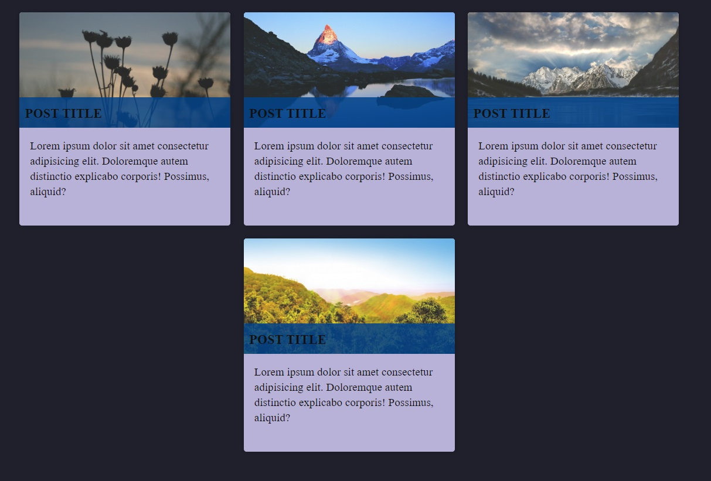

- Flexbox template 8
  
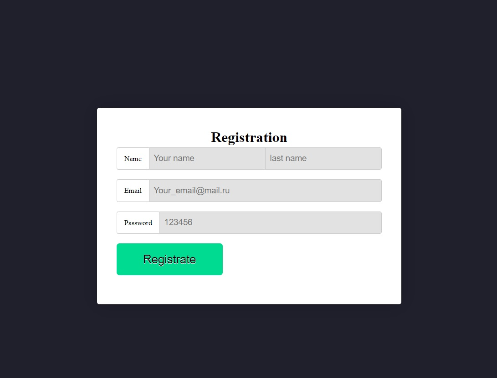

- Flexbox template 9

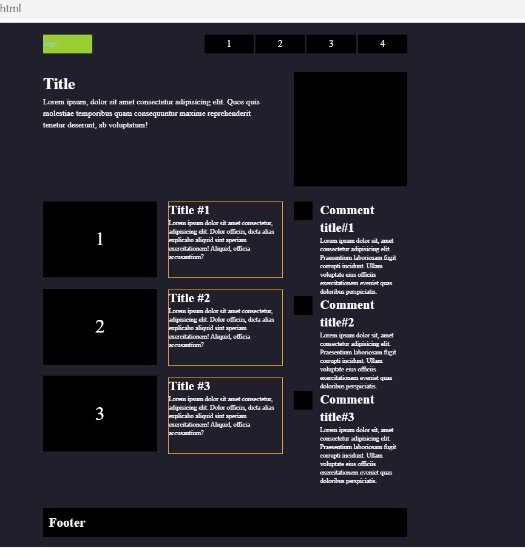

- Flexbox template 10

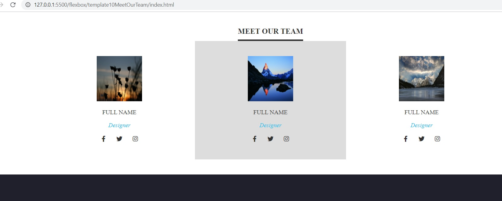

- Flexbox template 11
  
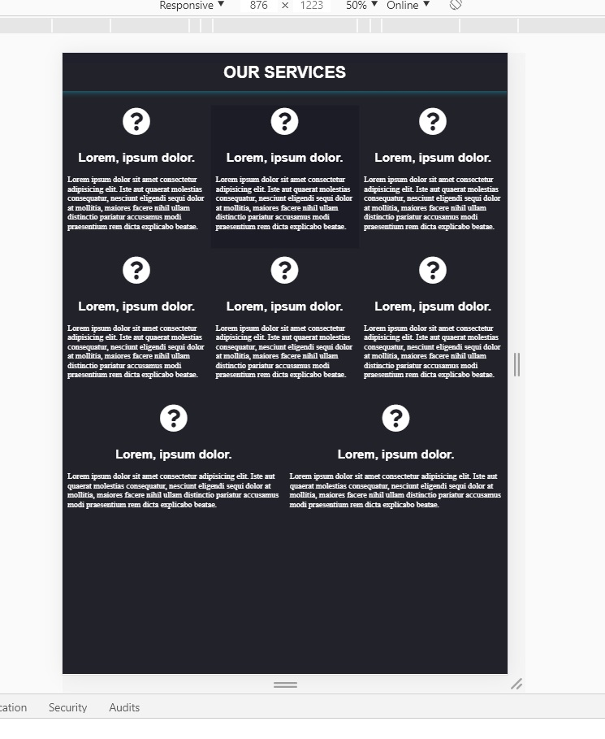

----

## Examples of simple dropdown menus

- ResponsiveNavMenuBar

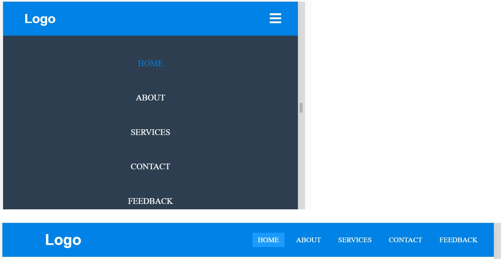

- NotResponsiveNavMenuBar

----

## Loading

- Loading template 1

----

## Other

- 404 Error template 1

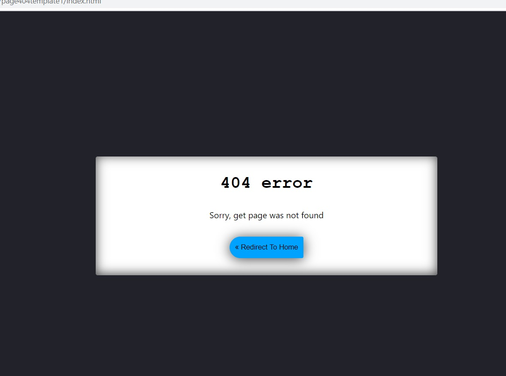

- Full landing page template 1 

- SideBar Menu 

